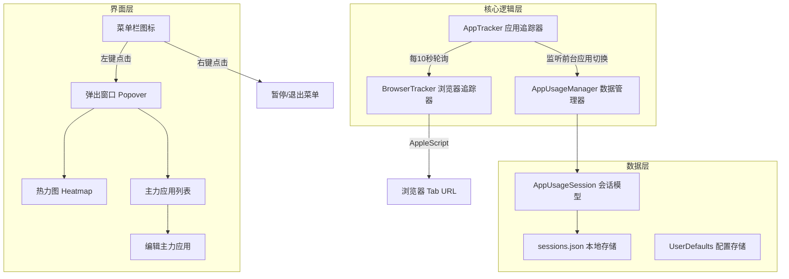
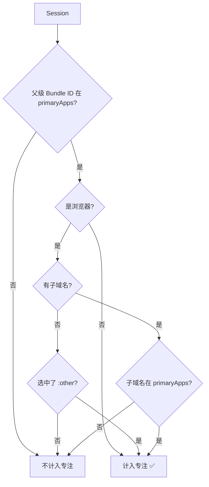

# PixLog 产品需求文档 (PRD)
> 📝 本文档由代码反推生成，基于 2026 年 1 月的代码版本

---

## 一、产品概述

### 1.1 产品定位
**PixLog** 是一款 macOS 菜单栏应用，专注于帮助用户追踪和可视化他们在电脑上的应用使用情况，特别关注"专注时间"的统计。

### 1.2 核心价值
- **量化专注时间**：自动记录用户使用"主力应用"的时长
- **直观可视化**：通过 GitHub 风格热力图呈现每日专注数据
- **浏览器深度追踪**：支持按域名细分浏览器使用时间

### 1.3 目标用户
- 需要量化工作效率的知识工作者
- 希望减少娱乐软件使用时间的自控用户
- 喜欢数据驱动的效率追踪爱好者

---

## 二、产品架构



---

## 三、功能模块

### 3.1 应用使用追踪（核心）

| 功能点 | 实现方式 | 数据存储 |
|--------|---------|---------|
| 前台应用检测 | `NSWorkspace.didActivateApplicationNotification` | 内存 → JSON |
| 使用时长计算 | 记录 `startTime` 和 `endTime`，实时计算差值 | `AppUsageSession` |
| 跨天拆分 | 自动将跨越午夜的会话拆分成多个会话 | `splitByDay()` 方法 |

**追踪生命周期：**
```
┌─────────────────────────────────────────────────────────────┐
│  App 启动 → 监听事件 → 检测切换 → 记录 Session → 保存到文件   │
└─────────────────────────────────────────────────────────────┘
        │                    │                 │
        ▼                    ▼                 ▼
   启动定时器            创建新 Session     5秒自动保存
   (每秒 tick)           结束上一个 Session   (防抖机制)
```

### 3.2 智能暂停机制

| 场景 | 触发条件 | 处理方式 |
|------|---------|---------|
| **用户闲置** | 5 分钟无鼠标/键盘操作 | 暂停记录，恢复时重新开始 |
| **屏幕休眠** | 系统发送 `screensDidSleepNotification` | 结束当前 Session，记录屏幕亮屏时长 |
| **手动暂停** | 用户右键点击菜单栏 → "暂停计时" | 停止所有追踪，图标变为暂停状态 |

> [!NOTE]
> 闲置检测使用 `IOKit` 获取系统闲置时间 (`HIDIdleTime`)，精度为纳秒级。

### 3.3 浏览器域名追踪

**支持的浏览器：**
| 浏览器 | Bundle ID | AppleScript 支持 |
|--------|-----------|------------------|
| Chrome | `com.google.Chrome` | ✅ |
| Safari | `com.apple.Safari` | ✅ |
| Edge | `com.microsoft.edgemac` | ✅ |
| Firefox | `org.mozilla.firefox` | ❌ (不支持 AppleScript) |

**追踪逻辑：**
1. 每 **10 秒** 检查一次当前浏览器标签页
2. 使用 AppleScript 获取 URL 和标题
3. 提取域名（自动移除 `www.` 前缀）
4. 域名变更时创建新的 Session

> [!IMPORTANT]
> 浏览器追踪需要用户授权自动化权限（系统偏好设置 → 隐私与安全性 → 自动化）

### 3.4 主力应用管理

**概念说明：**
- **主力应用**：用户手动标记的"专注工作"相关应用
- **专注时长**：仅使用主力应用的时间才计入专注时长
- **专注率**：专注时长 ÷ 屏幕亮屏时间 × 100%

**数据结构：**
```
primaryApps: Set<String>
├── "com.apple.dt.Xcode"                    // 普通应用
├── "com.google.Chrome"                      // 浏览器（父级）
│   ├── "com.google.Chrome:github.com"      // 浏览器子域名
│   ├── "com.google.Chrome:lovart.ai"       
│   └── "com.google.Chrome:other"           // 其他未分类域名
```

**选择逻辑：**


### 3.5 数据可视化

#### 3.5.1 月度热力图

**设计规格：**
- 布局：11 列 × 3 行 = 33 格
- 格子大小：20 × 20 像素
- 间距：4 像素

**颜色等级（5 级）：**
| 等级 | 专注时长 | 颜色 HEX |
|------|---------|----------|
| 0 | 0 分钟 | 透明/灰色 |
| 1 | 0-5 分钟 | `#EDF3ED` (20% 透明度) |
| 2 | 5-60 分钟 | `#A2EBB3` |
| 3 | 1-3 小时 | `#41BA60` |
| 4 | 3-6 小时 | `#289A45` |
| 5 | 6+ 小时 | `#125825` |

**交互：**
- 左右箭头切换月份
- 点击格子选中日期，显示当日数据
- 悬浮显示 Tooltip（日期 + 专注时长 + 专注率）
- "回到今天"按钮快速回到当前日期

#### 3.5.2 今日专注数据

显示内容：
- **专注时长**：格式 `Xh Ym` 或 `Xm` 或 `X秒`
- **专注率**：百分比形式

#### 3.5.3 主力应用列表

每个应用行显示：
- 应用图标（从系统获取）
- 应用名称
- 进度条（相对占比可视化）
- 使用时长

**浏览器可展开显示域名分解：**
```
▼ Chrome                    2h 30m
   ├─ GitHub              1h 20m
   ├─ Lovart              45m
   └─ 其他                 25m
```

### 3.6 编辑主力应用

**界面布局：**
1. 顶部：标题 + 关闭按钮
2. 应用列表：所有今日使用过的应用
3. 每个应用可勾选/取消勾选
4. 浏览器可展开选择具体域名

**筛选规则：**
- 只显示今日有使用记录的应用
- 按使用时长降序排列
- 浏览器域名限制最多 20 个

---

## 四、数据模型

### 4.1 AppUsageSession（核心）

```swift
struct AppUsageSession {
    let id: UUID
    let appName: String           // "Google Chrome"
    let bundleIdentifier: String  // "com.google.Chrome"
    let subIdentifier: String?    // "github.com" (仅浏览器)
    let startTime: Date           // 2026-01-17 10:00:00
    let endTime: Date             // 2026-01-17 11:30:00
    
    // 计算属性
    var duration: TimeInterval    // 5400 (秒)
    var fullIdentifier: String    // "com.google.Chrome:github.com"
    var displayName: String       // "Chrome - Github"
}
```

### 4.2 本地存储

| 数据类型 | 存储方式 | 路径 |
|----------|---------|------|
| 使用会话 | JSON 文件 | `~/Documents/PixLog/sessions.json` |
| 主力应用 | UserDefaults | Key: `PrimaryApps` |
| 屏幕时间 | UserDefaults | Key: `TodayScreenOnTime` |

---

## 五、用户界面

### 5.1 菜单栏图标

| 状态 | 图标 | 说明 |
|------|------|------|
| 正常 | `chart.bar.fill` | 柱状图图标 |
| 暂停 | `pause.circle` | 暂停圆圈图标 |

### 5.2 弹出窗口

- 尺寸：320 × 500 像素
- 行为：点击窗口外自动关闭 (`.transient`)
- 布局：固定头部热力图 + 可滚动的应用列表

### 5.3 右键菜单

| 菜单项 | 快捷键 | 功能 |
|--------|-------|------|
| 暂停计时 / 恢复计时 | - | 切换追踪状态 |
| 退出 PixLog | ⌘Q | 退出应用 |

---

## 六、技术细节

### 6.1 性能优化

| 优化点 | 实现方式 |
|--------|---------|
| 数据保存 | 防抖机制，每 5 秒批量保存 |
| 浏览器查询 | 每 10 秒轮询一次（非实时） |
| AppleScript | 后台队列执行，避免阻塞 UI |
| 数据索引 | 按日期 Key 索引，O(1) 查询 |

### 6.2 权限需求

| 权限 | 用途 | 可选性 |
|------|------|--------|
| 辅助功能 | 通过 IOKit 检测闲置时间 | 核心功能 |
| 自动化 | 浏览器域名追踪 | 可选（无权限时只追踪到浏览器级别） |

---

## 七、产品边界

### 7.1 当前版本已实现

- [x] 前台应用自动追踪
- [x] 浏览器域名级追踪（Chrome/Safari/Edge）
- [x] 闲置检测与暂停
- [x] 屏幕休眠感知
- [x] 主力应用手动设置
- [x] GitHub 风格热力图（5 等级）
- [x] 专注时长与专注率统计
- [x] 日期选择与历史查看
- [x] 应用筛选功能
- [x] 本地数据持久化

### 7.2 未实现 / 待扩展

- [ ] 数据导出（CSV/JSON）
- [ ] 每周/每月汇总报告
- [ ] 目标设定与提醒
- [ ] iCloud 同步
- [ ] 分类标签（工作/学习/娱乐）
- [ ] Firefox 域名追踪
- [ ] 数据统计图表（柱状图/趋势图）

---

## 八、总结

PixLog 是一款**轻量精致的专注时间追踪器**，核心设计理念是：

1. **被动追踪**：无需用户手动记录，全自动运行
2. **主动选择**：用户定义什么是"专注"，应用只负责统计
3. **直观呈现**：热力图一眼看出专注趋势
4. **隐私优先**：所有数据本地存储，不上传云端

> 🎯 一句话总结：**帮你量化「在正确的事情上花了多少时间」**
